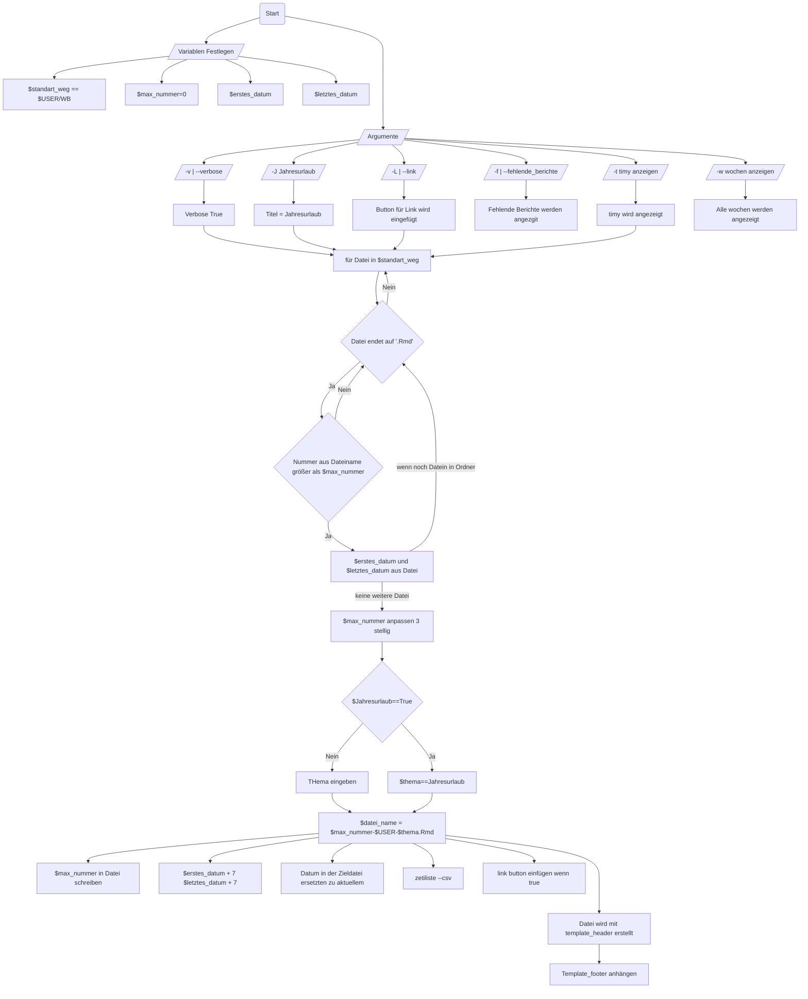

# nobrainer

```mermaid
flowchart TB
    A(Start) ----> B[/ Argumente /]
        A --> AA[/ Variablen Festlegen /]
            AA --> AAA[$standart_weg == $USER/WB]
            AA --> AAB[$max_nummer=0]
            AA --> AAC[$erstes_datum]
            AA --> AAD[$letztes_datum]
    B --> BA[/ -v | --verbose /]
        BA -->BAA[Verbose True]
        BAA --> C
    B --> BB[/ -J Jahresurlaub /]
        BB --> BBA[Titel = Jahresurlaub]
        BBA --> C
    B --> BC[/ -L | --link /]
        BC --> BCA[Button für Link wird eingefügt]
        BCA --> C
    B --> BE[/ -f | --fehlende_berichte /]
        BE --> BEA[Fehlende Berichte werden angezgit]
    B --> BF[/ -t timy anzeigen /]
        BF --> BFA[timy wird angezeigt]
        BFA --> C
    B --> BG[/ -w wochen anzeigen /]
        BG --> BGA[Alle wochen werden angezeigt]
    C[für Datei in $standart_weg] -->CA{Datei endet auf '.Rmd'}
        CA -->|Nein|C
        CA -->|Ja|CB{Nummer aus Dateiname größer als $max_nummer}
            CB -->|Nein|CA
            CB -->|Ja|CD[$erstes_datum und $letztes_datum aus Datei]
            CD -->| wenn noch Datein in Ordner|CA
            CD -->|keine weitere Datei|D[$max_nummer anpassen 3 stellig]
    D --> DA{$Jahresurlaub==True}
        DA -->|Nein|DAA[THema eingeben]
            DAA --> E
        DA -->|Ja|DAB[$thema==Jahresurlaub]
            DAB --> E[$datei_name = $max_nummer-$USER-$thema.Rmd]
            E ---> EA[Datei wird mit template_header erstellt]
                E --> EB[$max_nummer in Datei schreiben]
                E --> EC[$erstes_datum + 7 $letztes_datum + 7]
                E --> ED[Datum in der Zieldatei ersetzten zu aktuellem]
                E --> EE[zetiliste --csv]
                E --> EF[link button einfügen wenn true]
            EA --> F[Template_footer anhängen]
        F
```
